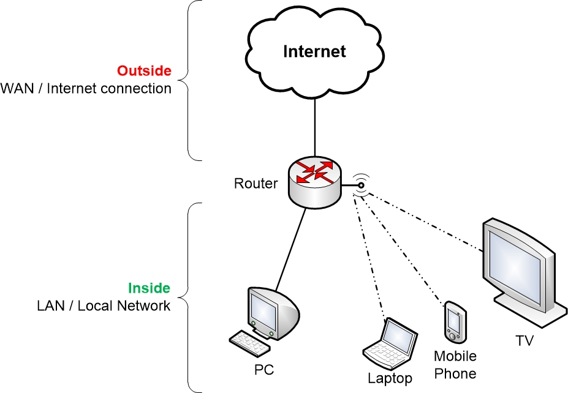
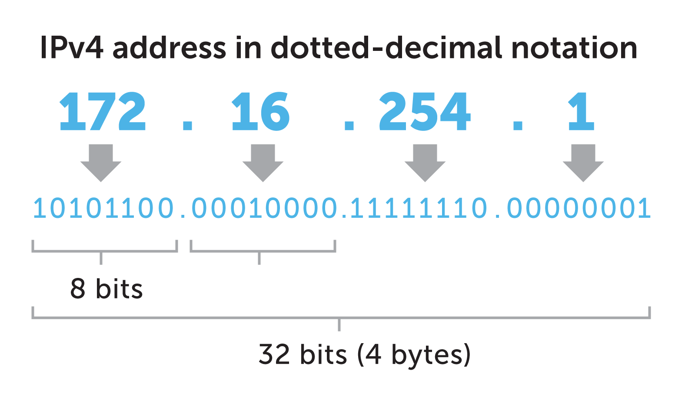
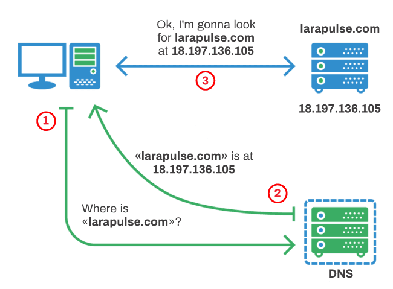
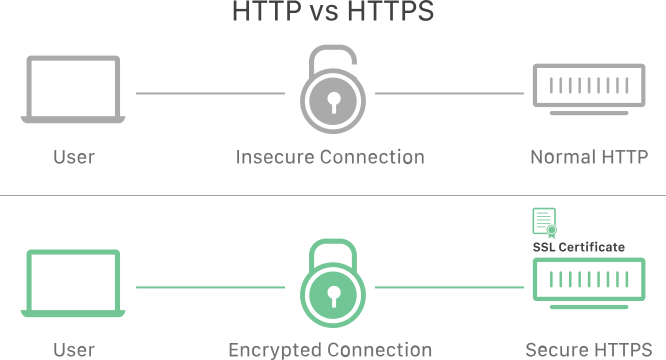

# Web Development

## Network

A **computer network** is a group of computers that use a set of common communication protocols over digital interconnections for the purpose of sharing resources located on or provided by the network nodes.

### Local area network (LAN)

A **local area network** is a computer network that interconnects computers within a limited area such as a residence, school, laboratory, university campus or office building.

### Wide area network (WAN)

A wide area network is a telecommunications network that extends over a large geographical area for the primary purpose of computer networking.

---

## Internet

The **Internet** is the global system of interconnected computer networks that uses the Internet protocol suite (TCP/IP) to communicate between networks and devices.

---

## IP

The **Internet Protocol (IP)** is the principal communications protocol in the Internet protocol suite for communicating across network boundaries.

---

## DNS

The **Domain Name System (DNS)** is a hierarchical and decentralized naming system for computers, services, or other resources connected to the Internet or a private network.

---

## Port

In computer networking, a **port** is a communication endpoint.

### HTTP port 80

**Port 80** is the port number assigned to commonly used internet communication protocol, **Hypertext Transfer Protocol (HTTP)**. It is the port from which a computer sends and receives Web client-based communication and messages from a Web server and is used to send and receive HTML pages or data.

### HTTPS port 443

**Hypertext Transfer Protocol Secure (HTTPS)** is an extension of the Hypertext Transfer Protocol (HTTP). It is used for secure communication over a computer network, and is widely used on the Internet.

---

## Browser / User agent

A **web browser / user agent** is a software application for accessing information on the World Wide Web. When a user requests a web page from a particular website, the web browser retrieves the necessary content from a web server and then displays the page on the screen.

**Browser knows HTML, CSS, JavaScript and Webassembly.**

---

## HTML

**Hypertext Markup Language (HTML)** is the standard markup language for documents designed to be displayed in a web browser. It can be assisted by technologies such as Cascading Style Sheets and scripting languages such as JavaScript.

> HTML Element

> HTML Attribute

---

## CSS

**Cascading Style Sheets (CSS)** is a style sheet language used for describing the presentation of a document written in a markup language like HTML. CSS is a cornerstone technology of the World Wide Web, alongside HTML and JavaScript.

>CSS declaration

---

## JavaScript

**JavaScript (JS)** is a programming language. Alongside HTML and CSS, JavaScript is one of the core technologies of the World Wide Web. JavaScript enables interactive web pages and is an essential part of web applications. The vast majority of websites use it for client-side page behavior.

---

## Webassembly

**WebAssembly** is a new type of code that can be run in modern web browsers and provides new features and major gains in performance. It is not primarily intended to be written by hand, rather it is designed to be an effective compilation target for low-level source languages like C, C++, Rust, etc.

---

## All Ref Links

1. [HTML basics](https://developer.mozilla.org/en-US/docs/Learn/Getting_started_with_the_web/HTML_basics)
2. [CSS basics](https://developer.mozilla.org/en-US/docs/Learn/Getting_started_with_the_web/CSS_basics)
3. [CSS Flow Layout](https://developer.mozilla.org/en-US/docs/Web/CSS/CSS_Flow_Layout)
4. [Display](https://developer.mozilla.org/en-US/docs/Web/CSS/display)
5. [Responsive images](https://developer.mozilla.org/en-US/docs/Learn/HTML/Multimedia_and_embedding/Responsive_images)
6. [Picture](https://developer.mozilla.org/en-US/docs/Web/HTML/Element/picture)
7. [https://css-tricks.com/responsive-images-css/](https://css-tricks.com/responsive-images-css/)
8. [Squoosh - PNG/JPG/JPEG to WEBP](https://squoosh.app/)
9. [Img Tag](https://developer.mozilla.org/en-US/docs/Web/HTML/Element/img)
10. [HTML symantec - YouTube Link](https://www.youtube.com/watch?v=naha1DIHK4E&t=746s)
11. [Position](https://developer.mozilla.org/en-US/docs/Web/CSS/position)
12. [Position - YouTube Link](https://www.youtube.com/watch?v=jx5jmI0UlXU)
13. [Box sizing](https://developer.mozilla.org/en-US/docs/Web/CSS/box-sizing)
14. [Background Clip](https://developer.mozilla.org/en-US/docs/Web/CSS/background-clip)

1. https://twitter.com/argyleink/status/1274364131928309762?s=20
2. https://twitter.com/geoffreycrofte/status/1274652138854121474?s=20
3. https://twitter.com/frontenddude/status/1273530077163261952?s=20
4. https://twitter.com/Duiker101/status/1272798990803836930?s=20
5. https://twitter.com/Duiker101/status/1272429815979814912?s=20
6. https://twitter.com/Duiker101/status/1272259524347510790?s=20
7. https://twitter.com/addyosmani/status/1272423597550657537?s=20
8. https://twitter.com/denicmarko/status/1271325929088794632?s=20

---

## 03/04/2020

### Files worked on 03/04/2020

1. box-model.html page
2. basic.html page

### Concepts cover on 03/04/2020

* HTML basics
* CSS basics
* Heading tags - h1, h2, h3, h4, h5 and h6
* p tag
* ol tag
* ul tag
* li tag
* a tag
* image
* font
* text-shadow
* Box model - padding, margin, border
* CSS Selector - element, id, class, pseudo-class

### Ref Links on 03/04/2020

1. [HTML basics](https://developer.mozilla.org/en-US/docs/Learn/Getting_started_with_the_web/HTML_basics)
2. [CSS basics](https://developer.mozilla.org/en-US/docs/Learn/Getting_started_with_the_web/CSS_basics)

---

## 04/04/2020

### Files worked on 04/04/2020

1. stay-safe.html page

### Concepts cover on 04/04/2020

* Box Shadow

### Ref Links on 04/04/2020

1. [Box Shadow](https://developer.mozilla.org/en-US/docs/Web/CSS/box-shadow)

---

## 05/04/2020

### Files worked on 05/04/2020

1. stay-safe.html

### Concepts cover on 05/04/2020

* HTML and CSS mental models.

---

## 06/04/2020

### Concepts cover on 06/04/2020

* CSS Flow Layout
* Display - Block, Inline

### Ref Links on 06/04/2020

1. [CSS Flow Layout](https://developer.mozilla.org/en-US/docs/Web/CSS/CSS_Flow_Layout)
2. [Display](https://developer.mozilla.org/en-US/docs/Web/CSS/display)

---

## 07/04/2020

### Files worked on 07/04/2020

1. src-set.html

### Concepts cover on 07/04/2020

* Responsive images
* Picture tag
* Source set (src-set)

### Ref Links on 07/04/2020

1. [Responsive images](https://developer.mozilla.org/en-US/docs/Learn/HTML/Multimedia_and_embedding/Responsive_images)
2. [Picture](https://developer.mozilla.org/en-US/docs/Web/HTML/Element/picture)
3. [https://css-tricks.com/responsive-images-css/](https://css-tricks.com/responsive-images-css/)
4. [Squoosh - PNG/JPG/JPEG to WEBP](https://squoosh.app/)

### Note

1. 1,92,233 bytes jpg (3X) 1,01,586 bytes webp
2. 54,164 bytes jpg (2X) 34,414 bytes webp
3. 19,154 bytes jpg (1X) 12,102 bytes webp

>We have save 1,80,131 bytes (18KB Approx*) for each user who is using out website, We should be proud of. We are saving worlds internet bandwidth! Happy Coding!

---

## 08/04/2020

### Files worked on 08/04/2020

1. img.html page

### Concepts cover on 08/04/2020

* Img tag

### Ref Links on 08/04/2020

1. [Img Tag](https://developer.mozilla.org/en-US/docs/Web/HTML/Element/img)

---

## 09/04/2020

### Concepts cover on 09/04/2020

* HTML symantec
* Position

### Ref Links on 09/04/2020

1. [HTML symantec - YouTube Link](https://www.youtube.com/watch?v=naha1DIHK4E&t=746s)
2. [Position](https://developer.mozilla.org/en-US/docs/Web/CSS/position)
3. [Position - YouTube Link](https://www.youtube.com/watch?v=jx5jmI0UlXU)

---

## 10/04/2020

### Files worked on 10/04/2020

1. background-clip.html
2. box-sizing.html

### Concepts cover on 10/04/2020

* HTML symantec
* Position

### Ref Links on 10/04/2020

1. [Box sizing](https://developer.mozilla.org/en-US/docs/Web/CSS/box-sizing)
2. [Background Clip](https://developer.mozilla.org/en-US/docs/Web/CSS/background-clip)

