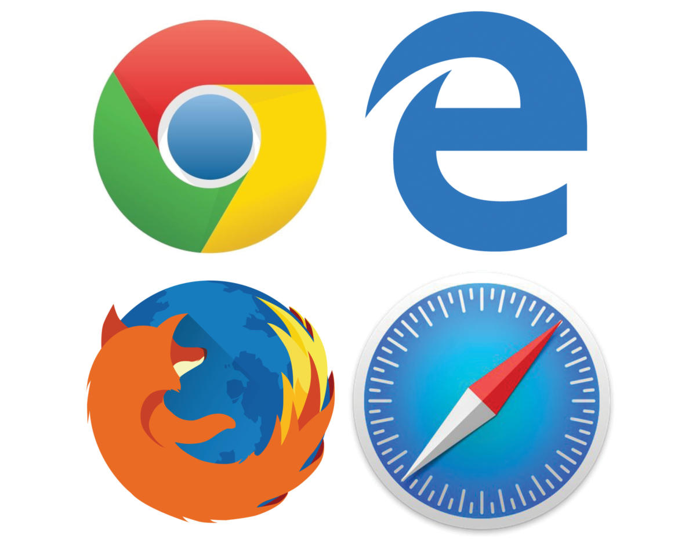

# Web Development

## Network

A **computer network** is a group of computers that use a set of common communication protocols over digital interconnections for the purpose of sharing resources located on or provided by the network nodes.

### Local area network (LAN)

A **local area network** is a computer network that interconnects computers within a limited area such as a residence, school, laboratory, university campus or office building.

### Wide area network (WAN)

A wide area network is a telecommunications network that extends over a large geographical area for the primary purpose of computer networking.

## Internet

The **Internet** is the global system of interconnected computer networks that uses the Internet protocol suite (TCP/IP) to communicate between networks and devices.

## IP

The **Internet Protocol (IP)** is the principal communications protocol in the Internet protocol suite for communicating across network boundaries.

## DNS

The **Domain Name System (DNS)** is a hierarchical and decentralized naming system for computers, services, or other resources connected to the Internet or a private network.

## Port

In computer networking, a **port** is a communication endpoint.

### HTTP port 80

**Port 80** is the port number assigned to commonly used internet communication protocol, **Hypertext Transfer Protocol (HTTP)**. It is the port from which a computer sends and receives Web client-based communication and messages from a Web server and is used to send and receive HTML pages or data.

### HTTPS port 443

**Hypertext Transfer Protocol Secure (HTTPS)** is an extension of the Hypertext Transfer Protocol (HTTP). It is used for secure communication over a computer network, and is widely used on the Internet.

## Browser / User agent

A **web browser / user agent** is a software application for accessing information on the World Wide Web. When a user requests a web page from a particular website, the web browser retrieves the necessary content from a web server and then displays the page on the screen.

## HTML

**Hypertext Markup Language (HTML)** is the standard markup language for documents designed to be displayed in a web browser. It can be assisted by technologies such as Cascading Style Sheets and scripting languages such as JavaScript.

> HTML Element

> HTML Attribute

## CSS

**Cascading Style Sheets (CSS)** is a style sheet language used for describing the presentation of a document written in a markup language like HTML. CSS is a cornerstone technology of the World Wide Web, alongside HTML and JavaScript.

>CSS declaration

## JavaScript

**JavaScript (JS)** is a programming language. Alongside HTML and CSS, JavaScript is one of the core technologies of the World Wide Web. JavaScript enables interactive web pages and is an essential part of web applications. The vast majority of websites use it for client-side page behavior.

